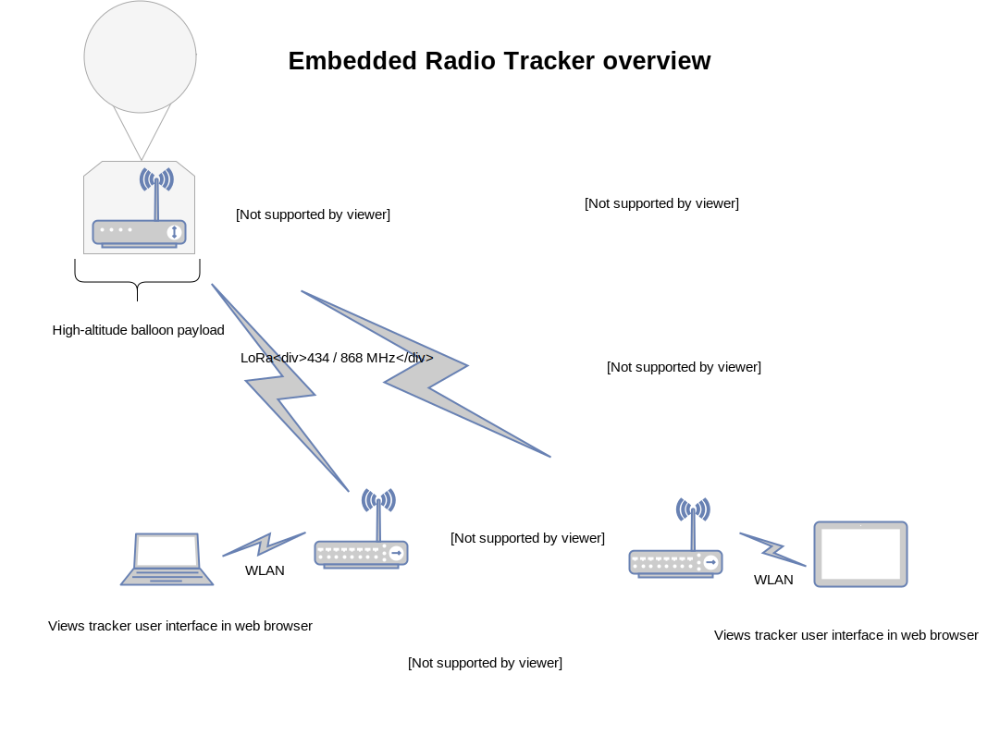

= Embedded Radio Tracker

**Embedded Radio Tracker** (ERT) is an application primarily aimed to track high-altitude balloons.
The software is modular and very configurable so it is basically a general-purpose radio tracker that can be
extended and modified easily. In addition to tracking high-altitude balloons, it could be used to track vehicles or
it could even function as a remote weather station.

*NOTE:* The project in its current state can be considered as a _proof-of-concept_ implementation,
since it has been tested very lightly and there are only few automated unit tests for the code.

== What is it?

The project consists of two applications:

* `ertnode` -- a tracker application transmitting GPS location, sensor and image data
* `ertgateway` -- a receiver application for all `ertnode` data

So, simply put...

=== ertnode

`ertnode` is an application that performs the actual tracking: it should be run in a device attached to the object that
needs to be tracked, e.g. a weather balloon or a vehicle. It collects telemetry data and takes photographs
(currently only with Raspberry Pi camera) and transmits most useful parts (e.g. location) of the data over
LoRa radio to `ertgateway` receivers.

See link:ertnode/README.adoc[ertnode documentation and installation instructions].

=== ertgateway

`ertgateway` is responsible for receiving telemetry data messages and images transmitted by `ertnode` and
providing network APIs and a user interface (with `ertgateway-ui-web`) to view the received data. The device
running `ertgateway` can be used as a fixed base station or, in the case of tracking high-altitude balloons,
as a mobile station in a chase car.

See link:ertgateway/README.adoc[ertgateway documentation and installation instructions].

== Web-based user interface: ertgateway-ui-web

`ertgateway-ui-web` is a web-based user interfaces that provides access to the telemetry data messages and images
received and collected by `ertgateway`. The user interface source code is in another repository and it has to be built
and installed separately from the rest of the application.

See link:https://github.com/mikaelnousiainen/ertgateway-ui-web/[ertgateway-ui-web source code in GitHub].

== Application internals

The project code is arranged in modules and layers, so that higher-level code uses plain C11 and POSIX APIs.
There is a lightweight hardware abstraction layer (HAL) in the code: Linux- and Raspberry Pi-specific code has
been extracted to separate modules.

The main applications `ertnode` and `ertgateway` have relatively small amount of code and application logic,
since they share much of their code. The shared functionality is provided by two libraries: `libert` and
`libertapp`.

=== libert

`libert` is a library containing a collection of hardware drivers, abstractions and commonly used routines needed to
develop embedded applications on Linux and Raspberry Pi (although most of the code is generic and can be used on
other hardware platforms too). It also includes some more specific functionality for ERT, such as the data logger
and sensor APIs. The library code is organized in modules that can be used as basic building blocks for
higher-level applications.

See link:libert/README.adoc[libert documentation].

=== libertapp

`libertapp` implements high-level features that are specific and common to both `ertnode` and `ertgateway`.
Most of the code consists of the implementation of the HTTP and WebSocket server and related API endpoint routines.

See link:libertapp/README.adoc[libertapp documentation].

== Software dependencies

The project code depends on a bunch of libraries, some of which have been cloned to either add CMake build support
or to modify it for more fine-grained configuration. Most of the libraries are included as GIT submodules in
the `deps` directory, because they are not widely available for easy installation in Linux distributions.

The included (and forked) library dependencies are:

* link:http://hardysimpson.github.io/zlog/[`zlog`] for fast and configurable application logging
** Support for CMake build was merged from another fork and adapted for better control of build artifacts
* link:http://www.digip.org/jansson/[`jansson`] `>= 2.10` for JSON encoding of logs and API responses
* link:https://github.com/msgpack/msgpack-c[`msgpack-c`] `>= 2.1.1` for MsgPack encoding and decoding of telemetry data transferred over wireless LoRa link
* link:https://libwebsockets.org/[`libwebsockets`] `>= 2.2.0` for HTTP and WebSocket APIs
* link:https://github.com/RPi-Distro/RTIMULib[`RTIMULib`] provides drivers for all link:https://www.raspberrypi.org/products/sense-hat/[Sense HAT] sensors and proper calculation of pose/orientation for IMU
* link:http://wiringpi.com/[`WiringPi`] `>= 2.44` for GPIO access and interrupt handlers: forked to support parameters (context) for interrupt handlers
** Support for interrupt handler context parameters added to my fork of `WiringPi` library

The external library dependencies, which need to be installed on the system, are:

* link:http://pyyaml.org/wiki/LibYAML[`libyaml`] `>= 0.1.6` for parsing YAML configuration
* link:http://catb.org/gpsd/[`gpsd`] `>= 3.16` for providing daemon and API to access GPS

To install the external library dependencies on Raspbian, execute:

[source,bash]
----
apt-get install gpsd libgps21 libgps-dev libyaml-0-2 libyaml-dev
----

=== External tool dependencies

The `ertnode` application takes photos with the Raspberry Pi camera and converts the photos to low-quality
thumbnails in WEBP format. These operations require the following external tools to be installed:

* link:https://www.raspberrypi.org/documentation/usage/camera/raspicam/raspistill.md[`raspistill`] command-line utility to take photographs using the Raspberry Pi camera
* link:https://www.imagemagick.org/[ImageMagick] `convert` for converting JPEG images to thumbnail WEBP
* link:https://developers.google.com/speed/webp/download[`cwebp`] command-line utility from `webp` package to add WEBP support to `convert`

To install these tools on Raspbian, execute:

[source,bash]
----
apt-get install libraspberrypi-bin webp imagemagick
----

== Hardware requirements

The minimum hardware requirements for running `ertnode` and `ertgateway` are:

* A Raspberry Pi model A+, B+, Zero, 2B or 3B (any model with 40-pin GPIO connector)
* A GPS receiver supported by `gpsd` -- any receiver outputting NMEA format data through serial port should work
* A Semtech SX127x / HopeRF RFM9xW LoRa radio transceiver connected to Raspberry Pi SPI port

There are more detailed hardware requirements and installation instructions available for both applications:
`ertgateway` and `ertnode`.

== Additional documentation

Modules:

* link:ertnode/README.adoc[ertnode] documentation and installation instructions
* link:ertgateway/README.adoc[ertgateway] documentation and installation instructions
* link:libert/README.adoc[libert] documentation
* link:libertapp/README.adoc[libertapp] documentation

Technical documentation:

* link:doc/http-and-websocket-api.adoc[HTTP and WebSocket API documentation]
* link:doc/comm-protocol.adoc[Communication protocol documentation]

== License

This Source Code Form is subject to the terms of the Mozilla Public
License, v. 2.0. If a copy of the MPL was not distributed with this
file, You can obtain one at link:http://mozilla.org/MPL/2.0/[http://mozilla.org/MPL/2.0/].
